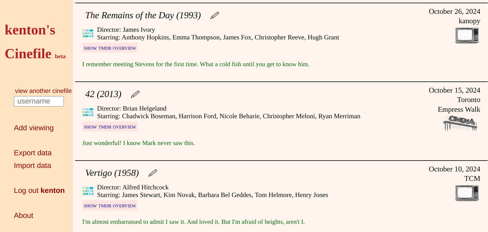

# Cinefile: your personal cinema journal
- by Mark Fruman mark.fruman@yahoo.com

### Deployed
- https://www.cinefile.me
- https://marks-cinefile-b5664d4051bf.herokuapp.com/

### Features
- keep record of films you see in cinemas and on video
- write and edit comments beziehungsweise reviews
- follow other accounts
- retrieve film data from [The Movie Database (TMDB)](https://www.themoviedb.org/)
- journal entries can be public or private
- import data from local JSON file
- export data to JSON file

### In Development
- post entries to X
- mobile-friendly version
- flexibility in import files (field names, CSV file)
